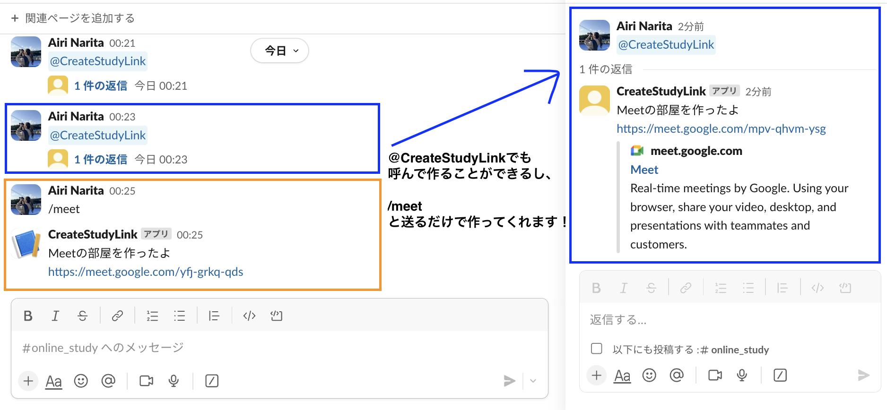
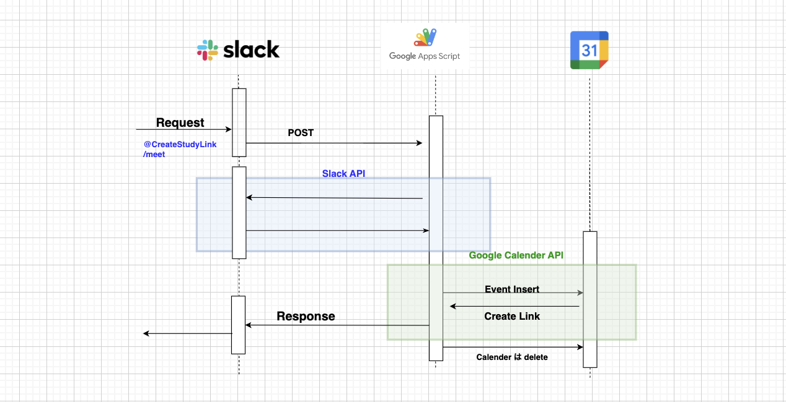

# Slack app_GoogleMeetBot

🚩 **Table of Contents**

- [🧐 What is this?](#🧐Whatisthis?)
- [💻 構成](#💻構成)
- [💻 作成方法](#💻作成方法)

## 🧐　What is this?

GASを簡易サーバーにして,SlackBotでGoogleMeetのリンクを自動送信するBOT！

以下２つの方法でslack送ると、上記写真のように自動でGoogleMeetのリンクを作成できます。
>
> - `@CreateStudyLink`をメンション
> - /meet と送信

## 💻 構成

| 技術 | 説明 |
| --- | --- |
| [Slack API](https://api.slack.com/) | Slack チャットプラットフォームとのインタラクションを可能にする API。 |
| [Google Apps Script (GAS)](https://www.google.com/script/start/) | Googleが提供するアプリケーション開発プラットフォーム JavaScriptで記述。 |
| Google Calendar API | Google カレンダーサービスへのアクセスを提供する API。 |

## 💻 作成方法

作成方法について[詳しくはこちらのページ](How_to_create.md)です。
